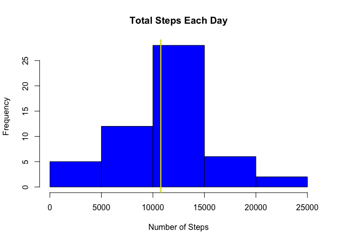
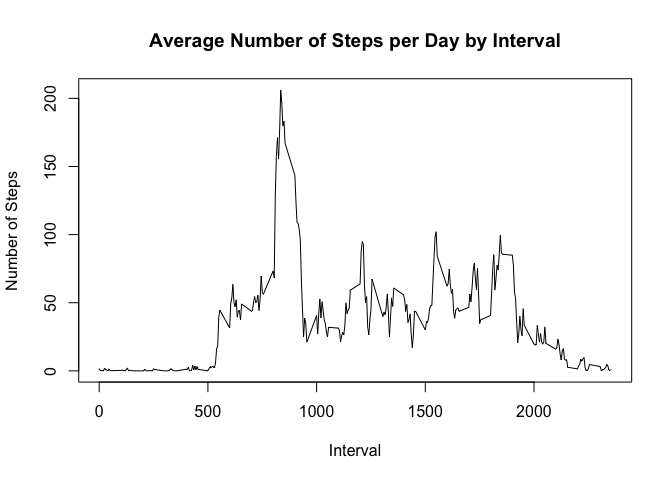
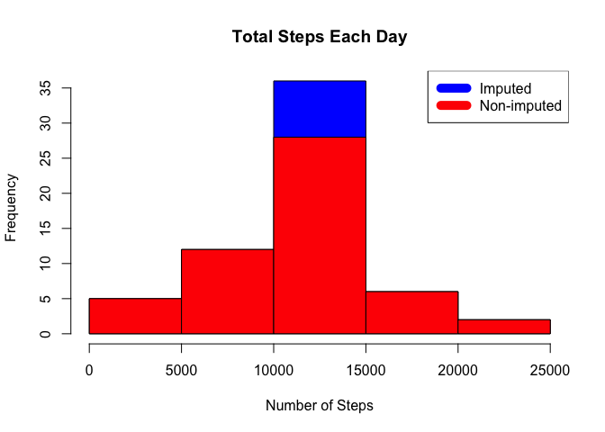
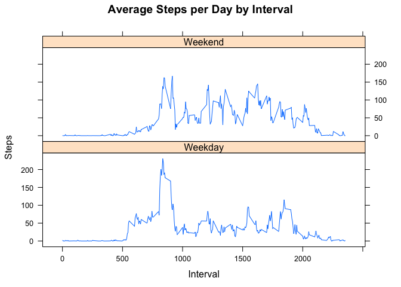

# Reproducible Research: Peer Assessment 1

## Loading and preprocessing the data

Download zip file from URL - save locally, unzip and read CSV file into data variable


```r
if(!file.exists("activity.zip")) {
  temp <- tempfile()
  download.file("http://d396qusza40orc.cloudfront.net/repdata%2Fdata%2Factivity.zip",temp)
  unzip(temp)
  unlink(temp)
}

data <- read.csv("activity.csv")
```


## What is mean total number of steps taken per day?

Using aggregate extract the total num of steps taken per day - create a histogram, plot mean and median on graph.


```r
steps_by_day <- aggregate(steps ~ date, data, sum)
hist(steps_by_day$steps, main = paste("Total Steps Each Day"), col="blue", xlab="Number of Steps")
rmean <- mean(steps_by_day$steps)
rmedian <- median(steps_by_day$steps)
abline(v = rmean, col = "black", lwd = 2)
abline(v = rmedian, col = "yellow", lwd = 2)
```



Mean total number of steps taken per day = 10766.19
Median total number of steps taken per day = 10765

## What is the average daily activity pattern?

Make a time series plot (i.e. 𝚝𝚢𝚙𝚎 = "𝚕") of the 5-minute interval (x-axis) and the average number of steps taken, averaged across all days (y-axis)


```r
steps_by_interval <- aggregate(steps ~ interval, data, mean)
plot(steps_by_interval$interval,steps_by_interval$steps, type="l", xlab="Interval", ylab="Number of Steps",main="Average Number of Steps per Day by Interval")
```



```r
max_interval <- steps_by_interval[which.max(steps_by_interval$steps),1]
```

Interval "835" contains on average the maximum number of steps (206.17 steps).

## Imputing missing values


```r
na_number <- sum(is.na(data$steps))
na_number
```

```
## [1] 2304
```

There are 2304 NA values in the dataset.
We need to devise a strategy to fill in these values with data.  
The strategy will be to insert the average 5 min interval (across all day) into missing intervals


```r
incomplete <- sum(!complete.cases(data))
imputed_data <- transform(data, steps = ifelse(is.na(data$steps), steps_by_interval$steps[match(data$interval, steps_by_interval$interval)], data$steps))
```

Recalculate total number of steps again and create histogram showing both imputed and non-imputed datasets with a legend


```r
steps_by_day_i <- aggregate(steps ~ date, imputed_data, sum)
hist(steps_by_day_i$steps, main = paste("Total Steps Each Day"), col="blue", xlab="Number of Steps")

#Create Histogram to show difference. 
hist(steps_by_day$steps, main = paste("Total Steps Each Day"), col="red", xlab="Number of Steps", add=T)
legend("topright", c("Imputed", "Non-imputed"), col=c("blue", "red"), lwd=10)
```



## Are there differences in activity patterns between weekdays and weekends?

Created a plot to compare and contrast number of steps between the week and weekend.


```r
weekdays <- c("Monday", "Tuesday", "Wednesday", "Thursday", "Friday")
imputed_data$dow = as.factor(ifelse(is.element(weekdays(as.Date(imputed_data$date)),weekdays), "Weekday", "Weekend"))

steps_by_interval_i <- aggregate(steps ~ interval + dow, imputed_data, mean)

library(lattice)

xyplot(steps_by_interval_i$steps ~ steps_by_interval_i$interval|steps_by_interval_i$dow, main="Average Steps per Day by Interval",xlab="Interval", ylab="Steps",layout=c(1,2), type="l")
```



There is a higher peak earlier on weekdays, and more overall activity on weekends.
